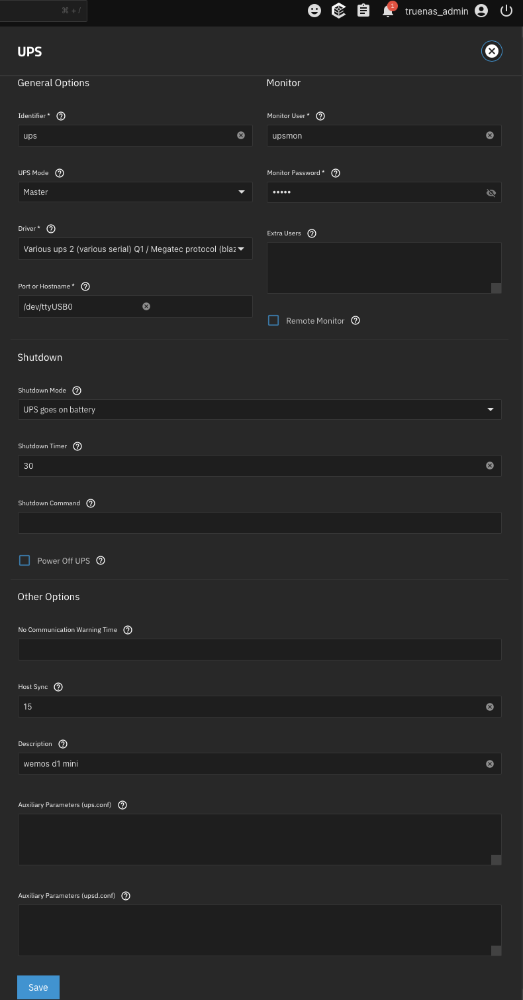

# DIY UPS system for TrueNAS

A complete DIY UPS monitoring system using an ESP8266/Wemos D1 Mini to integrate with TrueNAS for safe shutdowns during power outages.

I built a compact, energy-efficient NAS using a single board computer running TrueNAS. To protect my data from corruption during power outages (even with ZFS's resilience), I implemented a reliable battery backup system with automatic safe shutdown capabilities.

My office already has a 12V power infrastructure backed by a large lead-acid battery. Since the single board computer requires 15V @ 4A, I added a boost converter to step up the voltage. When utility power fails, the 12V supply automatically switches to battery power. This software running on an ESP8266 microcontroller monitors the battery voltage and notifies the NAS through the standard UPS protocol (NUT), triggering a safe shutdown when necessary.

## Complete System Components

My setup includes the following components (contains affiliate links):

- [Odroid H4+ Single Board Computer](https://ameridroid.com/?srsltid=AfmBOoqDbB_T41decJpGEYjgmkyJe_o7-6IlDazPkBZkVnyA1LZNtU2R) - Efficient and powerful NAS brain
- [M.2 NVMe SSD](https://amzn.to/47ShJmC) - For OS storage and boot drive
- [DDR4 RAM](https://amzn.to/4moGPNo) - Memory (4800MHz is maximum usable speed)
- [4TB SSDs (2x)](https://amzn.to/4mssvnj) - For 4TB effective storage in mirrored ZFS
- [5A 12V → 15V Boost Converter (ZK-SK90c)](https://amzn.to/4nGt7GV) - Steps up battery voltage for the NAS, includes LCD display for voltage/current readings
- [Wemos D1 Mini ESP8266](https://amzn.to/3KdiDAk) - Microcontroller for voltage monitoring
- [PowerPole Connectors](https://amzn.to/42uF2iQ) - For clean DC power connections
- [Epic PWRGate](https://www.dxengineering.com/parts/wmt-58404-1673) - For automatic battery fallback
- [PowerWerx SS30DV 12V Power Supply](https://powerwerx.com/ss30dv-desktop-dc-power-supply-powerpole) - Main 12V power source
- Lead Acid/AGM Battery - For backup power storage
- [TrueNAS Community Edition](https://www.truenas.com) - Operating system (formerly "TrueNAS Scale")
- [3D-Printed Enclosure](https://www.printables.com/model/944301-dc-buck-boost-converter-box-sk90-sk90c-sk40) - For housing the ESP8266 and boost converter


Alternatively, you could use some kind of Mini-ITX based system with a 12V [PicoPSU](https://www.onlogic.com/store/components/power-supplies/picopsu/).

## System Overview and Connection Diagram

```
+---------------+    +--------------+    +------------------+    +-------------+
| AC Power      |--->| 12V Power    |--->| Epic PWRGate     |<---| 12V Battery |
| (Wall Outlet) |    | Supply       |    | Power Controller |    | (Backup)    |
+---------------+    +--------------+    +------------------+    +-------------+
                                                 |
                                                 | 12V DC
                          +---------------------+----------------------+
                          |                     |                      |
                 +----------------+   +-----------------+    +------------------+
                 | ESP8266        |   | 12V → 15V       |    | Other 12V        |
                 | with Voltage   |   | Boost Converter |    | Equipment        |
                 | Divider        |   +-----------------+    +------------------+
                 +----------------+           |
                          |                   | 15V DC
                          |                   |
                          |            +------------------+
                          +----------->| TrueNAS Server   |
                           USB Serial  | (Odroid H4+)     |
                           Connection  +------------------+
```

### Power Flow and Connections

1. **Primary Power Path:**
   - AC wall power → 12V Power Supply → Epic PWRGate → Boost Converter → TrueNAS Server
   - During normal operation, the system runs from the AC-powered 12V supply

2. **Backup Power Path:**
   - 12V Battery → Epic PWRGate → Boost Converter → TrueNAS Server
   - When AC power fails, the Epic PWRGate automatically switches to battery power

3. **Monitoring System:**
   - ESP8266 monitors the 12V line voltage via a voltage divider
   - ESP8266 connects to TrueNAS via USB, providing UPS status information
   - When battery voltage drops below critical threshold, TrueNAS performs safe shutdown

## Project Overview

This project enables a TrueNAS server running on a single board computer such as an Odroid H4 to operate with a battery backup system, such as a lead-acid battery with a West Mountain Radio "Epic PWRgate" and Powerwerx S300V power supply. The ESP8266 microcontroller with a simple voltage divider circuit monitors the battery voltage and acts as a UPS interface for TrueNAS.

When utility power fails and battery voltage drops below the critical threshold, the system will send UPS 'NUT' protocol messages to the TrueNAS server, triggering a graceful shutdown to prevent data loss or filesystem corruption.

### TrueNAS Hardware Power Requirements

For reliable operation of TrueNAS hardware, such as an Odroid H4+ board:

- **Input Voltage**: 15V DC is required
- **Current Capacity**: At least 4 amps
- **Power Supply Options**:
  - For battery backup operation, use a DC-DC converter that can output 15V/4A from your 12V battery inpuy
  - Commercial options include adjustable boost converters with sufficient current capacity
  - Ensure the converter is rated for continuous operation at the required amperage

> **Note**: The voltage and current requirements may vary depending on your specific TrueNAS hardware. Check the specifications of your particular board.

## Features

- Measures input voltage through a voltage divider connected to A0 on the ESP8266 microcontroller
- Monitors battery voltage and generates UPS status information
- Outputs Network UPS Tools (NUT) compatible data via Serial/USB
- Optionally sends voltage readings to an MQTT server
- Designed for TrueNAS Scale/Community Edition integration via USB connection
- Configurable voltage thresholds for alerts and shutdown

## Step 1: Build The ESP8266 Voltage Monitor

### Components Required

- Wemos D1 Mini (ESP8266) microcontroller
- 470kΩ resistor
- 100kΩ resistor
- USB cable for connecting the microcontroller to TrueNAS server
- Power source for ESP8266 during testing (can be from your computer's USB port)
- Breadboard and wires (for prototyping)
- Optional: PCB for permanent installation

### Creating the Voltage Divider Circuit

The voltage divider is necessary because the ESP8266's analog input (A0) can only handle voltages up to 3.3V, while we need to measure higher voltages from a battery (typically 12-14V).

1. **Assemble the Circuit on a Breadboard:**
   - Connect the battery/power supply POSITIVE terminal to one end of the 470kΩ resistor
   - Connect the other end of the 470kΩ resistor to both the A0 pin and one end of the 100kΩ resistor
   - Connect the other end of the 100kΩ resistor to GND (ground)
   - Connect the NEGATIVE terminal of the battery/power supply to the Wemos D1 Mini GND pin

2. **Power Supply for Wemos D1 Mini:**
   - The Wemos D1 Mini can be powered directly from the TrueNAS USB connection
   - No additional power supply is needed for the microcontroller itself
   - The USB connection simultaneously provides power and serves as the data link to TrueNAS

3. **Circuit Diagram:**
   ```
                                  Wemos D1 Mini
                               +-----------------+
                               |                 |
                               |                 |
   Battery (+) ----+          +--+               |
   (12-14V)        |          |A0|               |
                   |          +--+               |
                   |           |                 |
                   |           |                 |
                   Z 470kΩ     |                 |
                   |           |                 |       USB to TrueNAS
                   |           |                 |    +----------------
                   +--------+--+                 |    |
                             |                   |    |
                             Z 100kΩ             |    |
                             |                   |    |
                             |                   +-+  |
   Battery (-) --------------+-------------------+G|--+
   (GND)                                         |N|
                                                 |D|
                                                 +-+
                                                   |
                                              +----+
                                              |
                                              = GND
   ```

4. **Voltage Calculation:**
   - The voltage divider ratio is: (470k + 100k) / 100k = 5.7
   - This allows measuring voltages up to approximately 18V (3.3V × 5.7) safely
   - The code includes calibration to improve accuracy

## Step 2: Build and Upload the ESP8266 Code

### PlatformIO Installation

This project uses PlatformIO for development. To install and use PlatformIO:

1. Install Visual Studio Code (VS Code) from [code.visualstudio.com](https://code.visualstudio.com/)

2. Open VS Code and install the PlatformIO extension:
   - Click on the Extensions icon in the sidebar (or press `Ctrl+Shift+X`)
   - Search for "PlatformIO"
   - Click "Install" on the PlatformIO IDE extension

3. After installation, restart VS Code and wait for PlatformIO to initialize

### Project Setup

1. Clone or download this repository

2. Open the project in VS Code with PlatformIO:
   - Click on the PlatformIO icon in the sidebar
   - Select "Open Project"
   - Navigate to the project folder and open it

3. Copy the configuration template:
   ```bash
   cp include/config.example.h include/config.h
   ```

4. Edit `include/config.h` with your settings:
   - WiFi SSID and password (if using MQTT)
   - MQTT server details (if using MQTT)
   - Set `MQTT_ENABLED` to true or false as needed
   - Adjust UPS voltage thresholds if necessary
   - Set `DEBUG_MODE` to true for troubleshooting

5. Build and upload the code:
   - Click on the PlatformIO icon in the sidebar
   - Under "Project Tasks", expand your project
   - Click "Build" to compile
   - Click "Upload" to flash to your Wemos D1 Mini

   Alternatively, use the command line:
   ```bash
   # Build the project
   pio run

   # Upload to the device
   pio run --target upload
   ```

## Step 3: Test and Calibrate the ESP8266 Monitor

### Testing with VSCode Serial Monitor

After uploading the code, you should test the ESP8266 to ensure it's correctly measuring voltage and responding to commands:

1. Keep the ESP8266 connected to your computer via USB
2. In PlatformIO, click on the "Serial Monitor" icon or run `pio device monitor` in the terminal
3. Set the baud rate to 2400 to match the code configuration
4. The monitor should show debug information if `DEBUG_MODE` is set to `true` in your config
5. You can test Megatec protocol commands by typing them into the serial monitor:
   - Type `Q1` and press Enter to get a status response
   - Type `F` to get rating information
   - Type `I` to get UPS information

### Multimeter Calibration

For accurate voltage readings, you should calibrate the device using a multimeter or the ZK-SK90c boost converter's built-in display:

1. **Setup for Calibration:**
   - Connect the battery system to the voltage divider as shown in the circuit diagram
   - Keep the Wemos D1 Mini connected to your computer via USB
   - Ensure `DEBUG_MODE` is set to `true` in your config.h to see the readings

2. **Calibration Procedure:**
   - Using a digital multimeter, measure the actual battery voltage
   - Note the voltage reported by the ESP8266 via the Serial Monitor
   - In `config.h`, set the following values:
     ```cpp
     #define USE_CALIBRATION 1         // Enable calibration
     #define THEORETICAL_READING 1165   // Your ESP8266 reading × 100 (e.g., 11.65V becomes 1165)
     #define MULTIMETER_READING 1401    // Your multimeter reading × 100 (e.g., 14.01V becomes 1401)
     ```
   - Upload the updated code to apply the calibration factor

3. **Verification:**
   - After uploading, check that the calibrated voltage matches your multimeter
   - Fine-tune the values if needed for maximum accuracy
   - Once calibrated, you can set `DEBUG_MODE` back to `false` for clean protocol output

### Communication Protocol

The ESP8266 module implements the Megatec protocol, which is a standard protocol used by many UPS manufacturers. The protocol implementation is based on the [Network UPS Tools (NUT) Megatec Protocol documentation](https://networkupstools.org/protocols/megatec.html). The module responds to the following commands (the NUT tool's UPS driver [blazer_ser.c](https://github.com/networkupstools/nut/blob/master/drivers/blazer_ser.c) expects these responses):

1. **Q1** - Status Inquiry ([implementation in main.cpp:431-469](https://github.com/networkupstools/nut/blob/master/drivers/blazer_ser.c#L145-L180)):
   - Returns UPS status data in format: `(MMM.M NNN.N PPP.P QQQ RR.R S.SS TT.T b7b6b5b4b3b2b1b0<cr>`
   - Where:
     - MMM.M is the input voltage
     - NNN.N is the input fault voltage
     - PPP.P is the output voltage
     - QQQ is the output current percentage
     - RR.R is the frequency
     - S.SS is the battery voltage
     - TT.T is the temperature
     - b7b6b5b4b3b2b1b0 is a status byte (bits indicating various UPS states)

2. **F** - UPS Rating Information ([implementation in main.cpp:470-482](https://github.com/networkupstools/nut/blob/master/drivers/blazer_ser.c#L229-L245)):
   - Returns rating data in format: `#MMM.M QQQ SS.SS RR.R<cr>`
   - Where:
     - MMM.M is the rating voltage (230V)
     - QQQ is the rating current (10A)
     - SS.SS is the battery voltage (12V)
     - RR.R is the rating frequency (50Hz)

3. **I** - UPS Information ([implementation in main.cpp:483-489](https://github.com/networkupstools/nut/blob/master/drivers/blazer_ser.c#L203-L217)):
   - Returns UPS information in format: `#Company_Name UPS_Model Version<cr>`
   - Contains manufacturer, model and version information

## Step 4: Assemble the Complete Power System

Now that your ESP8266 voltage monitor is working correctly, it's time to assemble the complete power system:

> Note: The ZK-SK90c boost converter includes an LCD display showing voltage and current readings. This can be helpful for calibrating the ESP8266 voltage readings by comparing the displayed values with what the ESP8266 reports.

1. **Prepare Components:**
   - Secure your 12V power supply and connect it to AC power
   - Prepare your lead-acid/AGM battery
   - Set up the Epic PWRGate for battery fallback
   - Prepare the 12V → 15V boost converter for the NAS

2. **Connect Everything:**
   - Connect the 12V power supply to the input of the Epic PWRGate
   - Connect the battery to the battery terminals of the Epic PWRGate
   - Connect the output of the Epic PWRGate to the input of the boost converter
   - Connect the 15V output from the boost converter to your TrueNAS server (Odroid H4+)
   - Connect your ESP8266 voltage divider to the 12V line from the Epic PWRGate
   - Connect the ESP8266 to your TrueNAS server via USB

3. **Final Housing:**
   - Place the ESP8266 and boost converter in the 3D-printed enclosure
   - Secure all connections with appropriate strain relief
   - Label all connections for future maintenance

## Step 5: TrueNAS General Configuration

Before setting up the UPS service, you should have TrueNAS properly installed and configured with your storage pools and shares. For detailed instructions on setting up TrueNAS, refer to the [official TrueNAS documentation](https://www.truenas.com/docs/scale/gettingstarted/).

## Step 6: Configure the UPS Service in TrueNAS

### Enable the UPS Service

1. Log in to the TrueNAS web interface as an administrator
2. Navigate to System Settings > Services
3. Find the UPS service in the list and click the edit icon (a pencil)
4. Check the box to "Enable" the service

### Configure the UPS Connection and Driver

In the UPS configuration window in TrueNAS Scale, set the following parameters:

1. **Identifier**: Give your UPS a name, such as `ups`

2. **Driver**: Select `Various ups 2 (various serial) Q1 / Megatec protocol (blazer_ser)` from the dropdown menu
   - This driver works with the Megatec protocol implemented in the code
   - `blazer_ser` is specifically designed for serial connections via /dev/ttyUSB0

3. **Port**: Set to the USB serial port where your ESP8266 is connected
   - This is usually `/dev/ttyUSB0` on TrueNAS systems
   - You can check available ports with `ls /dev/tty*` command in Shell
   - You may need to set correct permissions for the port: `chmod 777 /dev/ttyUSB0`

4. **Baud Rate**: TrueNAS Scale will automatically set this to 2400 baud for the Megatec protocol driver
   - No manual configuration of `ups.conf` is needed, TrueNAS handles this automatically



The screenshot above shows a typical configuration for the ESP8266 DIY UPS in TrueNAS Scale.

5. **Description**: Optional description like "ESP8266 DIY UPS Monitor"

6. **Save your configuration**

### Configure the Shutdown Policy

This is the most critical part that tells TrueNAS when to start the shutdown process:

1. In the UPS configuration window, go to the "Shutdown" section

2. Set the **Battery Level** field to a safe threshold (e.g., 10%)
   - This tells TrueNAS to shut down once the battery level reaches this percentage

3. You can also set a **Shutdown Timer** which tells the server to shut down after
   a specific number of seconds once power is lost

4. Set the **Shutdown Mode** to `Local` so the TrueNAS server shuts down itself

5. Click **Save** to apply your settings

TrueNAS will then automatically start the service and monitor your ESP8266 UPS monitor
for power loss or low battery signals.

> Note: TrueNAS unfortunately does not currently have a UPS dashboard for visual monitoring. You'll need to use the command-line tools like `upsc` to check the UPS status.


## Step 7: Verify and Test the UPS Integration

After configuring the UPS service, it's important to verify that TrueNAS can communicate with your ESP8266 UPS monitor and respond correctly to power events.

### Test NUT Communication

Open a shell in TrueNAS by clicking on the Shell icon in the TrueNAS web interface, then run:

```bash
# Check if device is recognized
ls -l /dev/ttyUSB*

# Test the NUT configuration (as root user)
upsc ups@localhost:3493
# Or run as the nut user (recommended)
sudo -u nut upsc ups@localhost
```

> Note: The "nut" user is already part of the dialout group in TrueNAS, so it should have the correct permissions to access the serial device without additional configuration.

### Example Expected Output

```
root@san:/mnt/pool1/users/denis# upsc ups@localhost:3493
Init SSL without certificate database
battery.charge: 100
battery.voltage: 14.40
battery.voltage.high: 13.00
battery.voltage.low: 10.40
battery.voltage.nominal: 12.0
device.type: ups
driver.name: blazer_ser
driver.parameter.pollinterval: 2
driver.parameter.port: /dev/ttyUSB0
driver.parameter.synchronous: auto
driver.version: 2.8.0
driver.version.internal: 1.58
input.current.nominal: 10.0
input.frequency: 50.0
input.frequency.nominal: 50
input.voltage: 230.0
input.voltage.fault: 230.0
input.voltage.nominal: 230
output.voltage: 230.0
ups.beeper.status: disabled
ups.delay.shutdown: 30
ups.delay.start: 180
ups.load: 50
ups.status: OL
ups.temperature: 25.0
ups.type: online
```

### Monitor UPS-Related System Logs

In the TrueNAS shell, you can check the system logs for UPS-related messages:

```bash
# Check system logs for UPS related messages
cat /var/log/syslog | grep -i ups
```

### Test with Fake Battery Mode

To test the UPS integration without actually disconnecting power:

1. Temporarily set `FAKE_BATTERY_FULL = false` and `UPS_LOW_VOLTAGE_THRESHOLD` to a value higher than your current battery voltage in the ESP8266's `config.h`
2. Upload the modified code to the ESP8266
3. Observe if TrueNAS detects the low battery condition
4. Return the settings to normal values when testing is complete

## Microcontroller Configuration Options

The ESP8266 behavior is controlled through the `config.h` file in the C/C++ source code:

- `MQTT_ENABLED`: Set to `true` to enable WiFi and MQTT publishing, `false` to disable
  - When enabled, the module will publish battery voltage readings to an MQTT server
  - Useful for remote monitoring or integration with home automation systems
- `DEBUG_MODE`: Set to `true` to enable debug output on serial, `false` for clean NUT protocol data
- `FAKE_BATTERY_FULL`: Set to `true` to always report battery at 100% and "OL" status (for testing)
- `HEARTBEAT_INTERVAL`: Time in milliseconds between heartbeat messages (default: 5000 ms = 5 seconds)
- `UPS_LOW_VOLTAGE_THRESHOLD`: Voltage at which to send a warning (default: 13.6V)
- `UPS_CRITICAL_VOLTAGE_THRESHOLD`: Voltage at which to trigger shutdown (default: 12.0V)
- `UPS_SHUTDOWN_DELAY`: Delay in seconds before shutdown after critical threshold (default: 30)

## Operational States

The UPS monitor reports these status conditions to TrueNAS:

- **OL** (Online): Normal operation, voltage above warning threshold
- **OB DISCHRG** (On Battery Discharging): Warning state, voltage below warning threshold
- **OB DISCHRG LB** (On Battery Discharging Low Battery): Critical state, voltage below critical threshold

## Troubleshooting

If you encounter issues with the UPS integration, try these troubleshooting steps:

1. **Verify ESP8266 Communication:**
   - Enable `DEBUG_MODE` in config.h to view detailed diagnostic information
   - Test the ESP8266 with the VSCode serial monitor at 2400 baud
   - Make sure the ESP8266 responds correctly to Megatec protocol commands (`Q1`, `F`, `I`)

2. **Check Hardware Connections:**
   - Verify voltage divider connections and resistor values
   - Use a multimeter to validate actual battery voltage against reported values
   - Ensure all power connections are secure and properly wired

3. **TrueNAS Connection Issues:**
   - Check system logs: `cat /var/log/syslog | grep -i ups`
   - Try a different USB port or USB cable
   - Test direct communication using `screen /dev/ttyUSB0 2400` and send `Q1` command

4. **Test with Fake Battery Mode:**
   - Set `FAKE_BATTERY_FULL = true` in config.h
   - This will report 100% battery and "OL" status regardless of actual readings
   - Useful for isolating hardware vs. software issues

5. **Restart NUT Services:**
   - In the TrueNAS shell, run:
     ```bash
     service nut-server restart
     service nut-monitor restart
     ```

## License

MIT License
